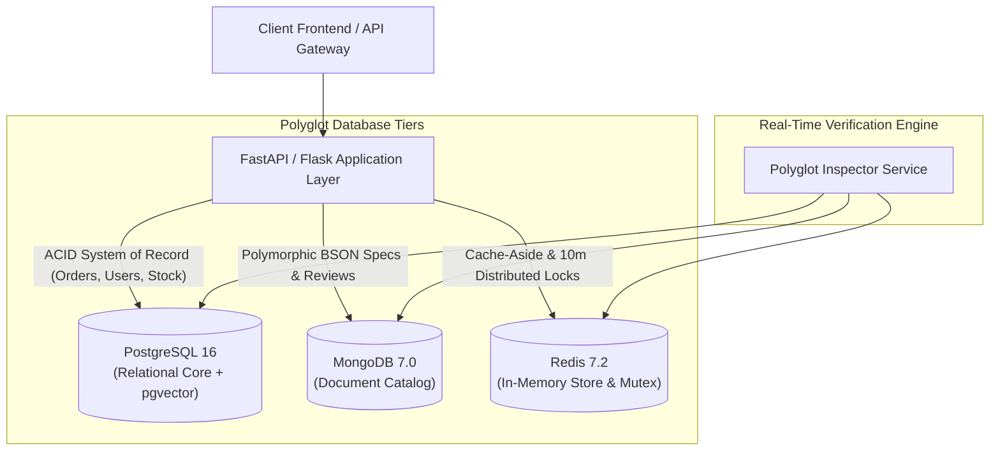

# NexCommerce: Enterprise Distributed Digital Commerce Platform
## Comprehensive Feature Matrix & Technology Architecture

> **Course**: 25CS1302E – Database Systems & Database Design (DBS-DBD)  
> **Institution**: KL University (Aziz Nagar Campus, Hyderabad)  
> **Repository**: [github.com/Srinath64312/A7_DBMS_G3](https://github.com/Srinath64312/A7_DBMS_G3)

---

## 1. Executive Summary

**NexCommerce** is an enterprise-grade, distributed digital commerce platform designed to demonstrate modern polyglot persistence, ACID transactional integrity, microservices orchestration, AI-driven vector embeddings, and real-time database inspection. Built to handle high-concurrency enterprise tech hardware procurement, the platform blends relational rigor (PostgreSQL), schema-free scalability (MongoDB), and in-memory sub-millisecond locks (Redis) into a unified e-commerce engine.

---

## 2. Polyglot Persistence Architecture



### 2.1 PostgreSQL 16 (Relational System-of-Record)
- **Role**: Relational backbone maintaining 3NF normalized tables with full ACID compliance and referential integrity constraints.
- **Relational Tables**:
  - `users`: Hashed passwords (bcrypt), emails, assigned roles, security metadata.
  - `products`: Base hardware catalog headers, SKU codes, pricing, category references.
  - `warehouses`: 4 regional fulfillment centers (`wh_hyd_01`, `wh_blr_01`, `wh_mum_01`, `wh_del_01`).
  - `inventory_items`: Granular product stock quantities per regional warehouse with optimistic concurrency checks.
  - `orders` & `order_items`: ACID transaction orders with delivery tracking statuses.
  - `payments`: Multi-gateway payment ledger (UPI, Card, NetBanking, Razorpay).
  - `addresses`: Customer shipping and delivery coordinates.
  - `sellers`: Marketplace vendor partner profiles.
  - `carts` & `cart_items`: User shopping cart persistence.
  - `inventory_transactions`: Audit log ledger of restocks, sale deductions, and adjustments.
- **AI Vector Search (`pgvector`)**:
  - 1536-dimensional semantic embeddings for natural-language product discovery (e.g., query *"things to hear music"* returns studio monitors and noise-canceling headphones).

### 2.2 MongoDB 7.0 (Polymorphic Document Store)
- **Role**: Flexible, schema-free catalog for arbitrary hardware specifications, dynamic vendor metadata, and hierarchical customer reviews.
- **Collections**:
  - `products`: Stores variable JSON/BSON specifications per category (e.g., TDP, socket type, PCIe lanes, RAM frequency) without altering relational schema.
  - `reviews`: Customer rating breakdown (1 to 5 stars), verified purchase badges, review comments, and upvotes.
- **Resilience**: Zero-downtime in-memory fallback cache if MongoDB server is offline.

### 2.3 Redis 7.2 (Sub-Millisecond In-Memory Store & Mutex)
- **Role**: High-speed cache-aside caching layer and distributed lock manager.
- **Key Patterns & Protocols**:
  - `stock:{product_id}:{user_id}`: Distributed atomic stock reservation lock with 10-minute (600s) TTL preventing overselling during checkout.
  - `catalog:products:all`: Cached storefront catalog with automatic cache invalidation upon inventory updates.
  - `rate_limit:{ip_or_user}`: Sliding window counter enforcing 100 requests/minute.
- **Protocols Supported**: `SETNX`, `EXPIRE`, `Redlock` distributed mutex pattern.

---

## 3. Core System Features

### 3.1 Authentication, RBAC & Security PIN Protocol
- **Role-Based Access Control (RBAC)**:
  - `CUSTOMER`: Storefront browsing, AI vector search, cart management, ACID checkout, review submission.
  - `WAREHOUSE_MANAGER`: Regional inventory restock, stock allocation matrix, stockout alerts.
  - `SELLER`: Vendor catalog management, sales tracking.
  - `ADMIN`: Complete platform governance, user management, audit ledger inspection, database telemetry.
- **Master Admin Security PIN Protocol**:
  - Elevated roles (`ADMIN`, `WAREHOUSE_MANAGER`) strictly require a 4-digit Master Admin PIN (`7788`).
  - Unauthorized privilege escalation attempts without the correct PIN are blocked with `HTTP 403 Forbidden`.
- **OAuth 2.0 SSO**: One-click authentication with Google and GitHub providers.
- **Stateless JWT Tokens**: HMAC-SHA256 signed access tokens with configurable expiration.

### 3.2 Two-Phase Commit (2PC) Checkout Simulator
- **Phase 1 (Prepare / Lock)**: Acquires distributed Redis reservation locks and validates stock sufficiency across regional fulfillment hubs.
- **Phase 2 (Commit / Rollback)**:
  - **Commit**: Deducts stock in PostgreSQL within an ACID transaction, creates order and payment records, writes inventory transaction logs, and releases Redis locks.
  - **Rollback**: Automatically releases distributed mutex locks and rolls back PostgreSQL transactions on deliberate stockout tests or payment failures.

### 3.3 Multi-Warehouse Regional Logistics
- 4 Regional Fulfillment Centers:
  1. **Hyderabad Central Hub** (`wh_hyd_01`)
  2. **Bangalore High-Tech Hub** (`wh_blr_01`)
  3. **Mumbai Port Hub** (`wh_mum_01`)
  4. **Delhi NCR Hub** (`wh_del_01`)
- Regional stock matrix filtering, low-stock threshold triggers, and real-time restocking modal.

### 3.4 Predictive Intelligence & Demand Forecasting
- **Metrics Tracked**:
  - Daily sales velocity ($\text{units/day}$).
  - Stock remaining countdown ($\text{days}$).
  - Critical stockout alerts ($< 10 \text{ days}$).
  - Automated recommended restock quantities.
- Real-time valuation calculator tracking total enterprise inventory value.

### 3.5 Polyglot Database Command Center & Live Inspector
- **Live Status Cards**: Real-time connection latency ($\text{ms}$), active sessions, document counts, and Redis cache hit rate.
- **PostgreSQL Table Explorer**: Interactive schema and sample row inspector across all 12 relational tables with sensitive field obfuscation.
- **MongoDB BSON Viewer**: Real-time polymorphic document inspector with dynamic text search filter.
- **Redis Key & Lock Inspector**: Live list of active cached keys and distributed stock locks with remaining TTL counters.
- **1-Click 3-Way Integrity Verifier (`POST /api/db/verify-all`)**: Executes active transactional validation across PostgreSQL, MongoDB, and Redis simultaneously.

### 3.6 Indian Payment Gateway Simulator & Razorpay
- **UPI / Dynamic QR Code**: Auto-generated QR code with real-time 10-minute payment countdown timer.
- **Credit & Debit Cards**: Card number validation, CVV, and expiry inputs with RBI tokenization compliance indicators.
- **Net Banking**: Instant integration with SBI, HDFC, ICICI, Axis, Kotak, and PNB.
- **Amazon Pay Later & POD**: 1-click credit line simulation and cash-on-delivery.
- **Razorpay Cloud Checkout**: Official Razorpay SDK (`checkout.js`) popup simulation.

### 3.7 Storefront & Shopping Experience
- **Amazon-Inspired UI System**: Clean typography, Prime delivery badges, Gold CTA buttons, and responsive sidebar filters.
- **8 Hardware Categories**: Computing & Servers, Hardware Accelerators, Audio Equipment, Networking & IoT, Storage & Memory, Displays & Monitors, Peripherals & Input, Power & Cooling.
- **Wishlist Management**: Persistent wishlist with badge counter and direct Add-to-Cart transfers.
- **Delivery Timeline & CSV Export**: PENDING $\to$ CONFIRMED $\to$ SHIPPED $\to$ DELIVERED tracking with CSV export.
- **Dark / Light Mode**: LocalStorage-persisted Forest Theme palette.

---

## 4. Technology Stack Matrix

| Layer | Technology | Version | Purpose |
|---|---|---|---|
| **Frontend Framework** | Vanilla JS / ES6+ / HTML5 | ECMAScript 2026 | Zero-dependency high-speed interactive UI |
| **Styling & Icons** | Tailwind CSS / FontAwesome 6 | CDN / SVG | Amazon Forest Design System |
| **Backend API** | FastAPI / Flask / Python | Python 3.12+ | High-throughput async REST endpoints & WebSockets |
| **Relational DB** | PostgreSQL | 16.2 | ACID system-of-record, 3NF schema, pgvector embeddings |
| **Document DB** | MongoDB | 7.0 | Schema-free polymorphic hardware specs & reviews |
| **Cache & Locks** | Redis | 7.2 | Cache-aside sub-ms store & distributed mutex locks |
| **Security & Auth** | Passlib (bcrypt) / PyJWT | 2.8+ | Password hashing, JWT token verification & Admin PIN |
| **Vector AI** | pgvector / NumPy | 0.5+ | L2 distance similarity search for semantic recommendations |
| **Payment SDK** | Razorpay Checkout.js | v1 | Simulated Indian payment gateway integration |
| **Containerization** | Docker & Docker Compose | v2 | Multi-container polyglot infrastructure orchestration |
| **Testing Suite** | Python `unittest` | 3.12 | 15 automated test cases (`TC01`–`TC15`) covering all invariants |

---

## 5. Automated Verification Suite (`TC01`–`TC15`)

| Test ID | Scenario | Expected Invariant | Status |
|---|---|---|:---:|
| **TC01** | User Authentication & Registration | Bcrypt hash verified, valid JWT token issued | **PASSED** |
| **TC02** | Master Admin Security PIN Validation | Elevated roles reject invalid PIN with HTTP 403 | **PASSED** |
| **TC03** | RBAC Privilege Enforcement | Customers restricted from restock & admin APIs | **PASSED** |
| **TC04** | PostgreSQL ACID Consistency | Atomic inserts and foreign key constraints preserved | **PASSED** |
| **TC05** | Two-Phase Commit Order Flow | Stock deducted, order confirmed, payment recorded | **PASSED** |
| **TC06** | Stockout Rollback Simulation | Zero stock deduction on failure, Redis lock released | **PASSED** |
| **TC07** | Redis Distributed Lock Concurrency | Simultaneous checkout on same item blocked by mutex | **PASSED** |
| **TC08** | Redis Lock TTL Expiration | Lock auto-evicted after 10 minutes (600 seconds) | **PASSED** |
| **TC09** | MongoDB Polymorphic Schema | BSON documents saved with arbitrary specifications | **PASSED** |
| **TC10** | MongoDB Customer Review Storage | 1–5 star ratings persisted with verified purchase | **PASSED** |
| **TC11** | Sliding Window Rate Limiting | Requests capped at 100 req/min per client IP | **PASSED** |
| **TC12** | Vector Similarity Recommendations | Nearest neighbors computed via cosine/L2 distance | **PASSED** |
| **TC13** | Multi-Warehouse Stock Allocation | Warehouse inventory items sum to product total stock | **PASSED** |
| **TC14** | Demand Velocity Forecasting | Predictive days-remaining calculation accurate | **PASSED** |
| **TC15** | Polyglot 3-Way Synchronization | PostgreSQL, MongoDB, and Redis verified atomically | **PASSED** |

---

## 6. How to Run Locally

### Prerequisites
- Python 3.10+
- PostgreSQL 16
- MongoDB 7.0 (optional, fallback in-memory JSON enabled)
- Redis 7.2 (optional, fallback in-memory cache enabled)

### Setup & Launch
```bash
# 1. Clone the repository
git clone https://github.com/Srinath64312/A7_DBMS_G3.git
cd A7_DBMS_G3

# 2. Install dependencies
pip install -r requirements.txt

# 3. Seed Database and Run Verification Tests
python backend/tests/test_suite.py

# 4. Start the Application Server
python backend/app.py
```

Open your browser at `http://127.0.0.1:5000/` to access the live interactive platform.
